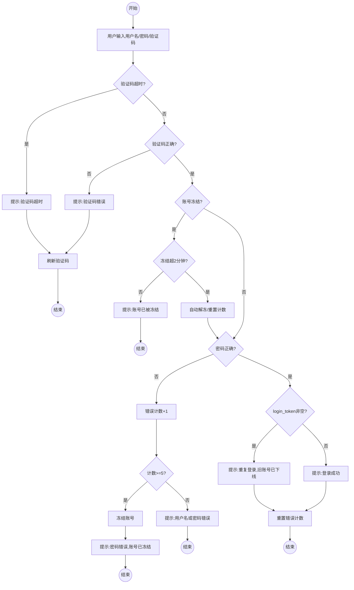

## 用户登录模块

### 功能概述

提供用户身份认证功能，包括用户名密码验证、验证码校验、账号冻结/解冻机制、重复登录检测。核心在于多层安全验证流程，防止暴力破解和非法登录。

### 界面要素与数据定义

| 字段名称     | 字段键 (Key)    | 类型     | 可编辑 | 默认值 | 校验规则         |
| :----------- | :-------------- | :------- | :----- | :----- | :--------------- |
| 用户 ID      | id              | Int      | 否     | AUTO   | 系统自动生成     |
| 用户名       | user_name       | String   | 否     | -      | 必填             |
| 密码         | user_password   | String   | 否     | -      | 必填             |
| 用户状态     | user_status     | Int      | 否     | 0      | 0: 正常, 1: 冻结 |
| 登录令牌     | login_token     | String   | 否     | 空     | 用于重复登录检测 |
| 最后登录时间 | last_login_time | DateTime | 否     | -      | 系统自动记录     |
| 错误计数     | error_count     | Int      | 否     | 0      | 登录失败次数     |
| 冻结时间     | freeze_time     | DateTime | 否     | -      | 冻结开始时间     |

### 业务流程

### 详细交互逻辑

#### 页面布局

- **显示规则**：PC 端横版布局，左侧为占位图片区域，右侧为登录表单。
- **表单元素**：用户名输入框、密码输入框、验证码输入框、登录按钮。

#### 验证码功能

- **生成规则**：随机生成个位数 (1-9) 的加减乘算式，如 "3 + 5 = ?"。
- **刷新操作**：点击验证码区域可手动刷新。
- **超时规则**：验证码生成超过 60 秒后自动失效，提示"验证码超时，请重试！"。

#### 登录验证 (Login)

- **交互动作**：用户填写表单后点击"登录"按钮。
- **验证顺序**：验证码超时 → 验证码正确性 → 账号冻结状态 → 用户名密码正确性。
- **成功处理**：显示"登录成功！"，重置错误计数，更新最后登录时间。
- **失败处理**：显示"用户名或密码错误！"，错误计数加 1。

#### 账号冻结与解冻 (Freeze/Unfreeze)

- **冻结触发**：连续登录失败 5 次后，user_status 设为 1，记录 freeze_time。
- **冻结期间**：显示"账号已被冻结，请稍后再试！"，不进行密码验证。
- **自动解冻**：冻结时间超过 120 秒后，系统自动将 user_status 设为 0，错误计数归零。

#### 重复登录处理 (Repeat Login)

- **检测机制**：系统通过 login_token 检测用户是否已在其他设备或浏览器登录。
- **互踢逻辑**：当用户登录成功时，若检测到该账号已有有效的登录会话（login_token 非空），系统自动使旧会话失效。
- **用户提示**：重复登录成功时，显示"重复登录，旧账号已下线！"，提示用户旧设备已被强制下线。

### 测试数据

| 用户名 | 密码   | 说明         |
| :----- | :----- | :----------- |
| admin  | 123456 | 默认测试账号 |
